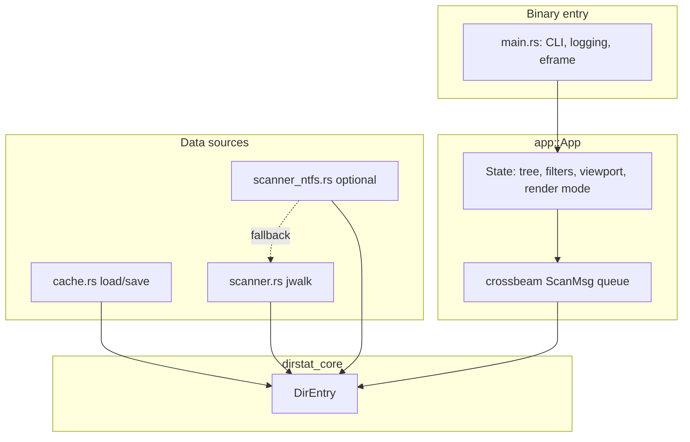
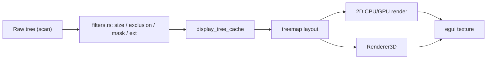
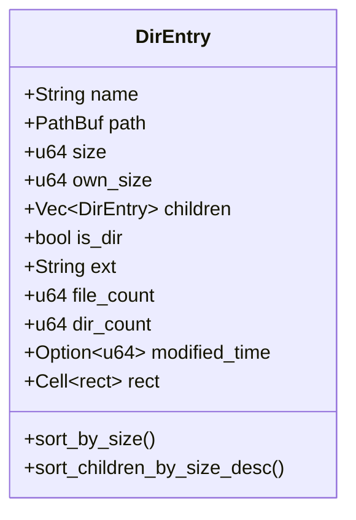
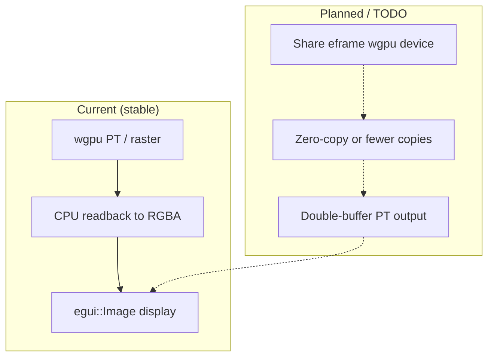

# DIAGRAMS.md — dirstat-rs (Mermaid)

## Application layer

```mermaid
flowchart TB
  subgraph Entry["Binary entry"]
    MAIN["main.rs: CLI, logging, eframe"]
  end

  subgraph UI["app::App"]
    STATE["State: tree, filters, viewport, render mode"]
    CHANNEL["crossbeam ScanMsg queue"]
  end

  subgraph Data["Data sources"]
    CACHE["cache.rs load/save"]
    SCAN_J["scanner.rs jwalk"]
    SCAN_N["scanner_ntfs.rs optional"]
  end

  subgraph Model["dirstat_core"]
    DIR["DirEntry"]
  end

  MAIN --> STATE
  CACHE --> DIR
  SCAN_J --> DIR
  SCAN_N --> DIR
  SCAN_N -.->|fallback| SCAN_J
  STATE --> CHANNEL
  CHANNEL --> DIR
```

## Display pipeline

```mermaid
flowchart LR
  T["Raw tree (scan)"]
  F["filters.rs: size / exclusion / mask / ext"]
  D["display_tree_cache"]
  L["treemap layout"]
  R2["2D CPU/GPU render"]
  R3["Renderer3D"]

  T --> F --> D --> L
  L --> R2
  L --> R3
  R2 --> E["egui texture"]
  R3 --> E
```

## Directory entity (logical)

```mermaid
classDiagram
  class DirEntry {
    +String name
    +PathBuf path
    +u64 size
    +u64 own_size
    +Vec~DirEntry~ children
    +bool is_dir
    +String ext
    +u64 file_count
    +u64 dir_count
    +Option~u64~ modified_time
    +Cell~rect~ rect
    +sort_by_size()
    +sort_children_by_size_desc()
  }
```

## GPU / future (from TODOs)

```mermaid
flowchart TB
  subgraph Current["Current (stable)"]
    GPU_PT["wgpu PT / raster"]
    READBACK["CPU readback to RGBA"]
    EG_UI["egui::Image display"]
  end

  subgraph Planned["Planned / TODO"]
    SHARED["Share eframe wgpu device"]
    ZCOPY["Zero-copy or fewer copies"]
    DBL["Double-buffer PT output"]
  end

  GPU_PT --> READBACK --> EG_UI
  SHARED -.-> ZCOPY -.-> DBL -.-> EG_UI
```
