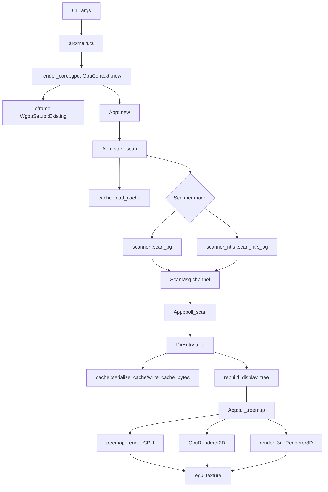
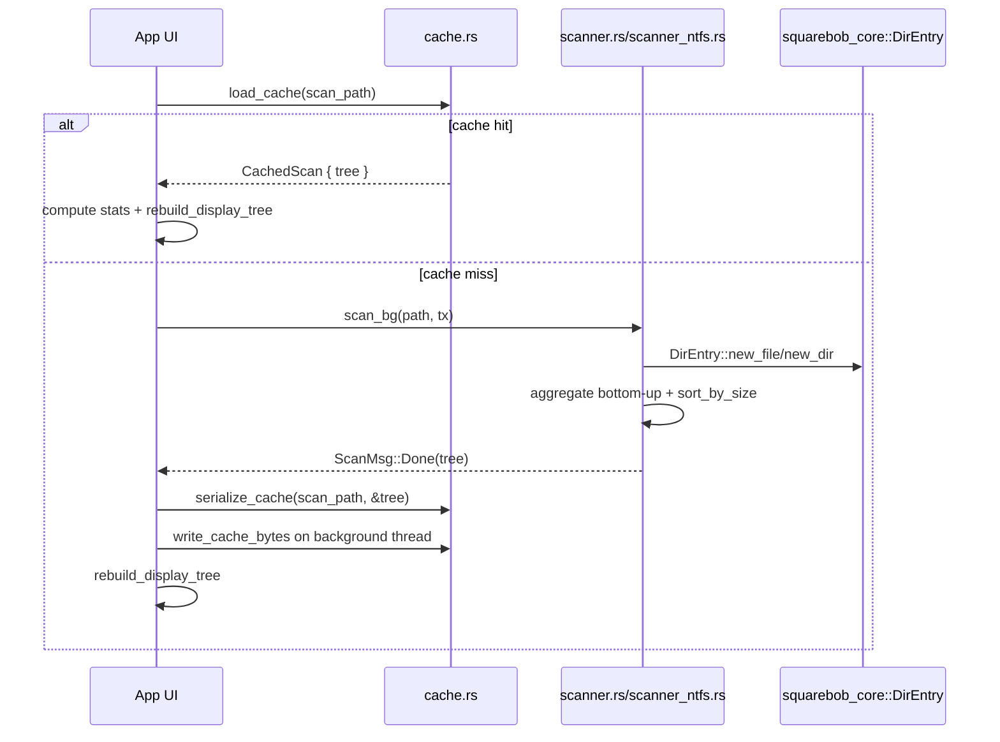
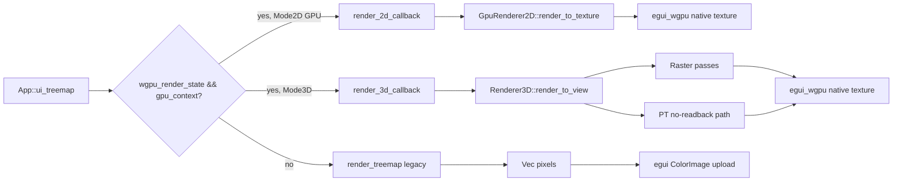
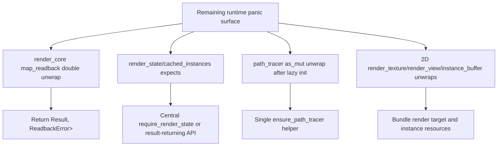

# DIAGRAMS.md

## Application Dataflow



## Shared GPU Readback Blast Radius

```mermaid
flowchart TD
    TreemapLegacy[treemap::GpuRenderer2D::render] --> ReadbackTexture[render_core::gpu::readback_texture]
    Render3DLegacy[Renderer3D::render] --> ReadbackTexture
    PTReadback[pt::megakernel::render_path_traced] --> ReadbackTexture
    Screenshot[src/app/screenshot.rs] --> Render3DLegacy
    ReadbackTexture --> MapReadback[render_core::gpu::map_readback]
    MapReadback --> MapAsync[BufferSlice::map_async]
    MapAsync --> CallbackResult[callback Result]
    CallbackResult --> Channel[std::sync::mpsc channel]
    Channel --> DoubleUnwrap[rx.recv().unwrap().unwrap]
    DoubleUnwrap --> Panic[panic on sender drop or BufferAsyncError]
```

## Scan And Cache Sequence



## Render Path Split



## Remaining Panic Surface


