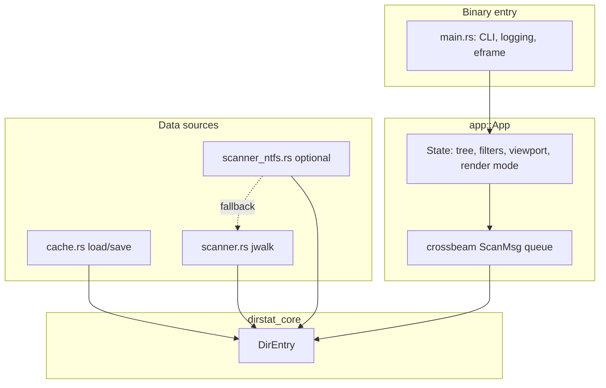
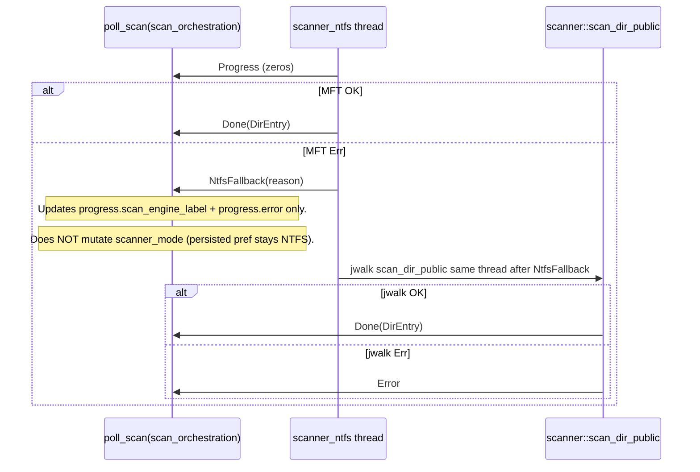
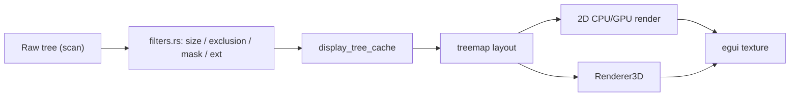
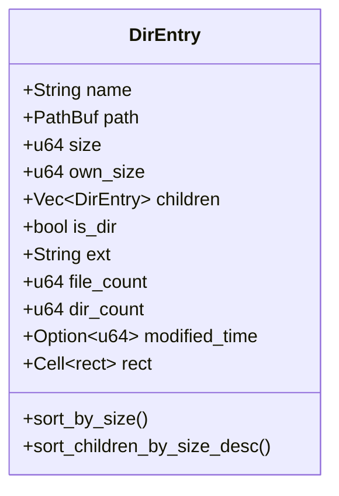
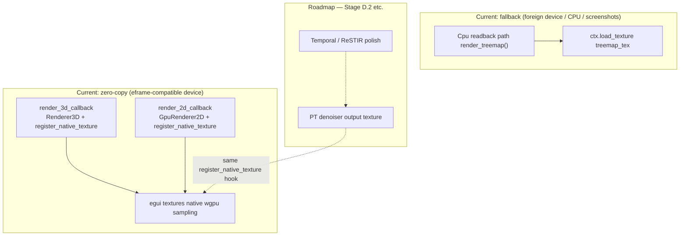

# DIAGRAMS.md — dirstat-rs (Mermaid)

## Application layer

## NTFS scan fallback (Windows)

## Display pipeline

## Directory entity (logical)

## Display GPU paths (actual vs fallback vs roadmap)

Treemap pane chooses paths in `src/app/treemap_view.rs` (`use_callback`:
`wgpu_render_state.is_some()` and `gpu_context.is_some()` and mode/backend).

Readback fallback remains required when `GpuContext` is **not**
shareable with egui (`AGENTS.md` / `render_treemap` comment block).
