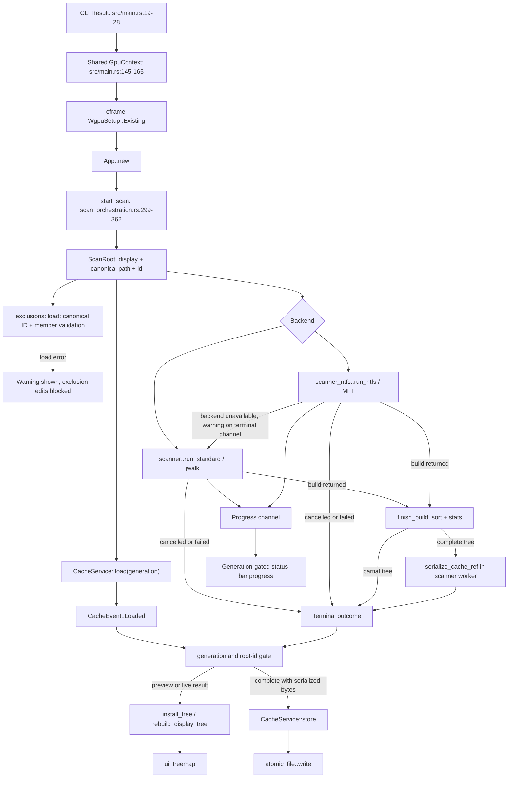
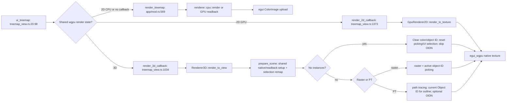
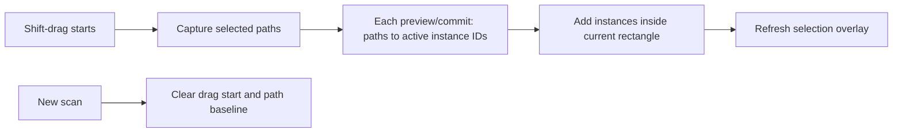
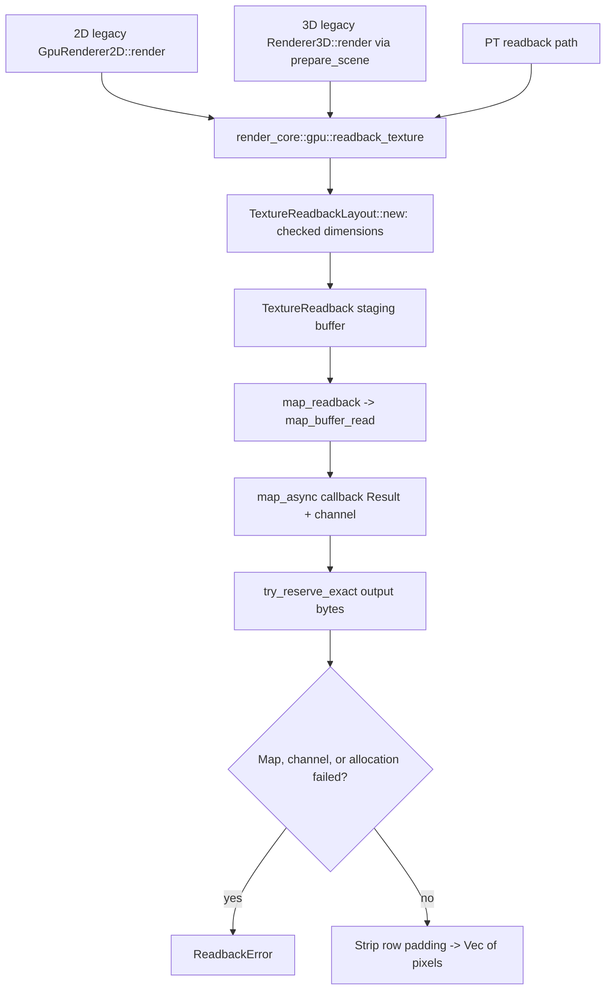
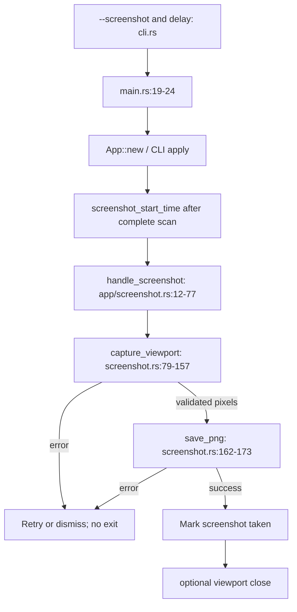
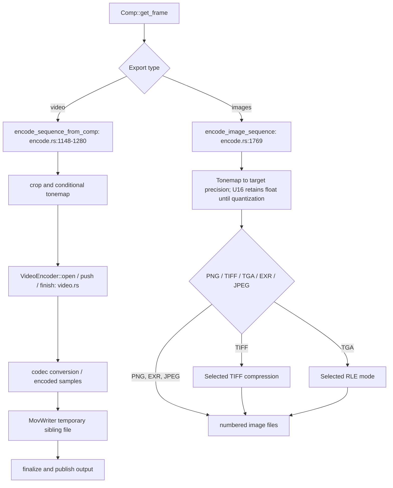

# Application diagrams

Updated: 2026-09-23. These diagrams describe inspected source paths. See [AGENTS.md](AGENTS.md) for operating constraints, [plan11.md](plan11.md) for original findings, and [plan12.md](plan12.md) for the current repair review.

## Scan, cache, and display dataflow

```mermaid
flowchart TD
    CLI["CLI Result: src/main.rs:19-28"] --> GPU["Shared GpuContext: src/main.rs:145-165"]
    GPU --> Eframe["eframe WgpuSetup::Existing"]
    Eframe --> App["App::new"]
    App --> Start["start_scan: scan_orchestration.rs:299-362"]
    Start --> Root["ScanRoot: display + canonical path + id"]
    Root --> Exclusions["exclusions::load: canonical ID + member validation"]
    Exclusions -->|load error| Warning["Warning shown; exclusion edits blocked"]
    Root --> CacheCmd["CacheService::load(generation)"]
    Root --> Select{"Backend"}
    Select --> Standard["scanner::run_standard / jwalk"]
    Select --> NTFS["scanner_ntfs::run_ntfs / MFT"]
    NTFS -->|backend unavailable; warning on terminal channel| Standard
    Standard -->|build returned| Build["finish_build: sort + stats"]
    NTFS -->|build returned| Build
    Standard -->|cancelled or failed| Terminal["Terminal outcome"]
    NTFS -->|cancelled or failed| Terminal
    Build -->|complete tree| Serialize["serialize_cache_ref in scanner worker"]
    Build -->|partial tree| Terminal
    Serialize --> Terminal
    Standard --> Progress["Progress channel"]
    NTFS --> Progress
    CacheCmd --> CacheEvent["CacheEvent::Loaded"]
    CacheEvent --> Gate["generation and root-id gate"]
    Progress --> UIStatus["Generation-gated status bar progress"]
    Terminal --> Gate
    Gate -->|preview or live result| Install["install_tree / rebuild_display_tree"]
    Gate -->|complete with serialized bytes| Store["CacheService::store"]
    Store --> Atomic["atomic_file::write"]
    Install --> UI["ui_treemap"]
```

Cache I/O is owned by an ordered worker with per-root generation watermarks (`src/cache.rs:107-124,174-245`). Only complete scans queue a cache store (`src/app/scan_orchestration.rs:237-250`).

## Scan and cache sequence

```mermaid
sequenceDiagram
    participant UI as App UI
    participant CS as CacheService
    participant SW as Scan worker
    participant FS as Filesystem
    UI->>UI: Retire old scan, advance generation, clear presentation
    UI->>UI: Load exclusions; show warning and block edits on error
    UI->>CS: Load(generation, ScanRoot)
    UI->>SW: spawn(generation, root, backend)
    CS->>FS: Read and validate flat cache
    CS-->>UI: Loaded(generation, root_id, result)
    UI->>UI: Gate by generation/root_id; optional preview
    SW->>FS: jwalk or NTFS MFT
    opt NTFS unavailable
        SW-->>UI: NtfsFallback on terminal channel
        SW->>FS: Standard scanner fallback
    end
    SW-->>UI: Progress (bounded channel)
    opt A build returned
        SW->>SW: Sort tree and compute stats
        opt Complete tree
            SW->>SW: Serialize cache bytes
        end
    end
    SW-->>UI: Terminal(Completed/Partial/Cancelled/Failed)
    UI->>UI: Gate and install live tree
    opt Completed with serialized bytes
        UI->>CS: Store(generation, root, bytes)
        CS->>FS: Atomic cache replacement
        CS-->>UI: Stored(result)
    end
```

## Rendering and readback branches

```mermaid
flowchart LR
    UI["ui_treemap: treemap_view.rs:20-98"] --> Select{"Shared wgpu render state?"}
    Select -->|2D CPU or no callback| Legacy["render_treemap: app/mod.rs:569"]
    Select -->|2D GPU| GPU2D["render_2d_callback: treemap_view.rs:1373"]
    Select -->|3D| GPU3D["render_3d_callback: treemap_view.rs:1034"]
    Legacy --> CPU["renderer::cpu::render or GPU readback"]
    CPU --> Upload["egui ColorImage upload"]
    GPU2D --> Native2D["GpuRenderer2D::render_to_texture"]
    Native2D --> EguiNative["egui_wgpu native texture"]
    GPU3D --> View["Renderer3D::render_to_view"]
    View --> Prepare["prepare_scene: shared native/readback setup + selection remap"]
    Prepare --> Empty{"No instances?"}
    Empty -->|yes| Clear["Clear color/object ID; reset picking/UI selection; skip OIDN"]
    Empty -->|no| Raster{"Raster or PT"}
    Clear --> EguiNative
    Raster -->|raster| Pass["raster + active object-ID picking"]
    Raster -->|PT| Trace["path tracing; current Object ID for outline; optional OIDN"]
    Pass --> EguiNative
    Trace --> EguiNative
```

Shift-drag selection keeps path identity across instance rebuilds (`src/app/treemap_view.rs:412-458,729-767`; `src/app/scan_orchestration.rs:91-111`).

```mermaid
flowchart LR
    Drag["Shift-drag starts"] --> Baseline["Capture selected paths"]
    Baseline --> Remap["Each preview/commit: paths to active instance IDs"]
    Remap --> Inside["Add instances inside current rectangle"]
    Inside --> Overlay["Refresh selection overlay"]
    NewScan["New scan"] --> Reset["Clear drag start and path baseline"]
```

```mermaid
flowchart TD
    T2D["2D legacy GpuRenderer2D::render"] --> Copy["render_core::gpu::readback_texture"]
    R3D["3D legacy Renderer3D::render via prepare_scene"] --> Copy
    PT["PT readback path"] --> Copy
    Copy --> Layout["TextureReadbackLayout::new: checked dimensions"]
    Layout --> Stage["TextureReadback staging buffer"]
    Stage --> Map["map_readback -> map_buffer_read"]
    Map --> Callback["map_async callback Result + channel"]
    Callback --> Reserve["try_reserve_exact output bytes"]
    Reserve --> Error{"Map, channel, or allocation failed?"}
    Error -->|yes| ResultErr["ReadbackError"]
    Error -->|no| Pixels["Strip row padding -> Vec of pixels"]
```

The older double-`unwrap` panic diagram is obsolete: `map_buffer_read` returns typed errors, and output allocation is fallible (`crates/render-core/src/lib.rs:740-805,807-839`).

## Screenshot and media codepaths

```mermaid
flowchart TD
    Args["--screenshot and delay: cli.rs"] --> Main["main.rs:19-24"]
    Main --> App["App::new / CLI apply"]
    App --> Timer["screenshot_start_time after complete scan"]
    Timer --> Maybe["handle_screenshot: app/screenshot.rs:12-77"]
    Maybe --> Capture["capture_viewport: screenshot.rs:79-157"]
    Capture -->|validated pixels| Save["save_png: screenshot.rs:162-173"]
    Capture -->|error| Failure["Retry or dismiss; no exit"]
    Save -->|error| Failure
    Save -->|success| Done["Mark screenshot taken"]
    Done --> Exit["optional viewport close"]
```

```mermaid
flowchart TD
    Comp["Comp::get_frame"] --> Choice{"Export type"}
    Choice -->|video| Video["encode_sequence_from_comp: encode.rs:1148-1280"]
    Video --> Crop["crop and conditional tonemap"]
    Crop --> Encoder["VideoEncoder::open / push / finish: video.rs"]
    Encoder --> Convert["codec conversion / encoded samples"]
    Convert --> Mux["MovWriter temporary sibling file"]
    Mux --> Commit["finalize and publish output"]
    Choice -->|images| Sequence["encode_image_sequence: encode.rs:1769"]
    Sequence --> Tone["Tonemap to target precision; U16 retains float until quantization"]
    Tone --> Writer{"PNG / TIFF / TGA / EXR / JPEG"}
    Writer -->|TIFF| Tiff["Selected TIFF compression"]
    Writer -->|TGA| Tga["Selected RLE mode"]
    Writer -->|PNG, EXR, JPEG| Frames["numbered image files"]
    Tiff --> Frames
    Tga --> Frames
```

The image-sequence writer now routes selected TIFF and TGA compression to their encoders (`crates/media-encoder/src/dialogs/encode/encode.rs:1664-1680,1718-1762`). App capture supplies RGBA8 (`src/app/image_sequence.rs:257-267`), so its U16 export cannot recover higher source precision.
