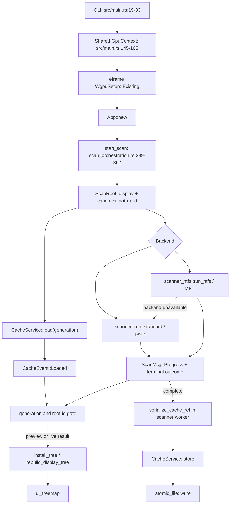
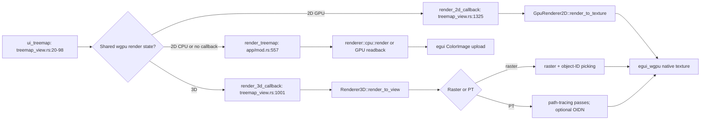
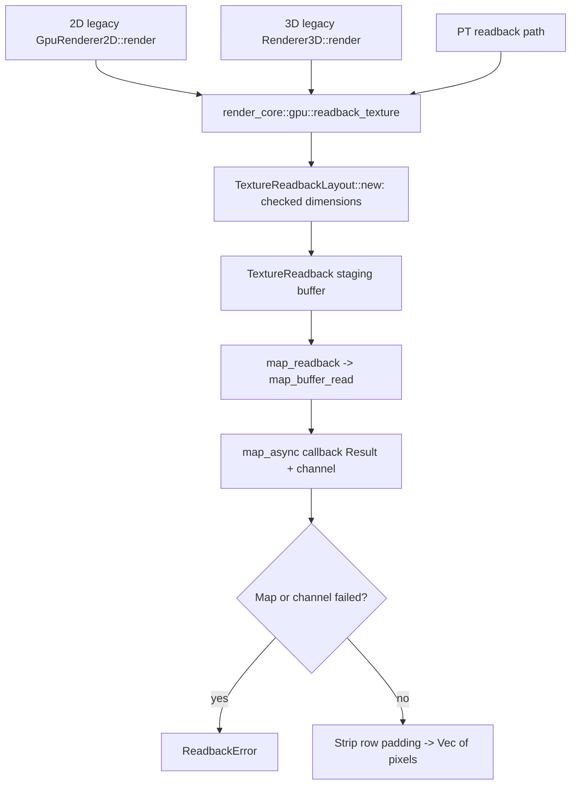
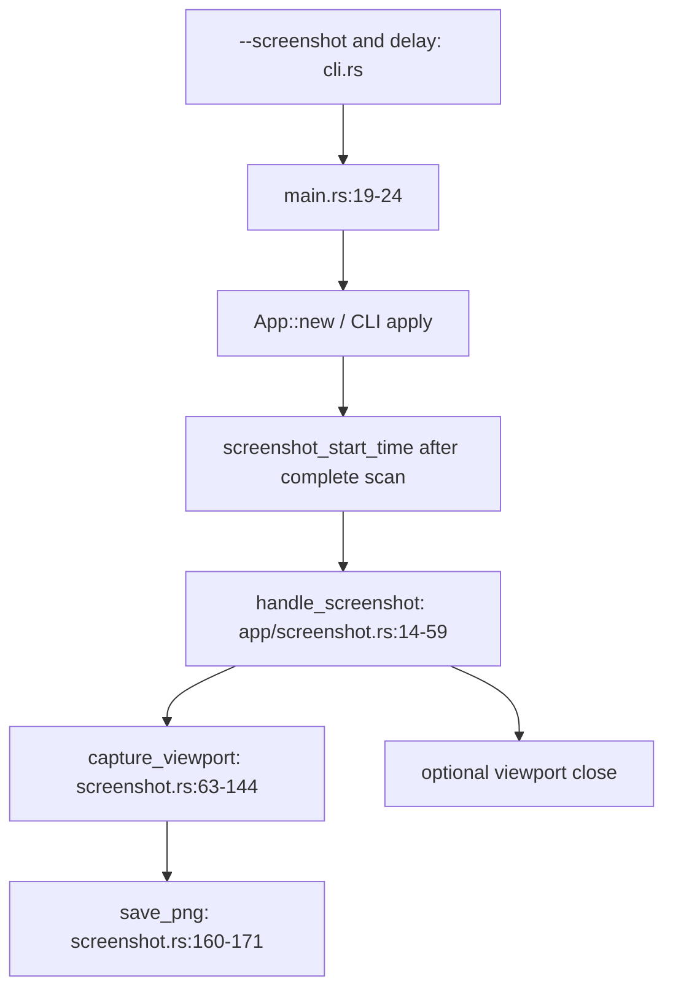
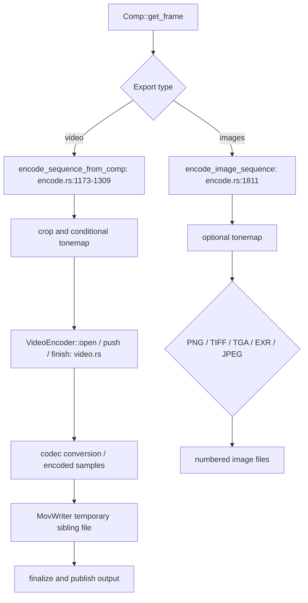

# Application diagrams

Updated: 2026-09-23. These diagrams describe inspected source paths. See [AGENTS.md](AGENTS.md) for operating constraints and [plan11.md](plan11.md) for defects and proposed repairs.

## Scan, cache, and display dataflow

```mermaid
flowchart TD
    CLI["CLI: src/main.rs:19-33"] --> GPU["Shared GpuContext: src/main.rs:145-165"]
    GPU --> Eframe["eframe WgpuSetup::Existing"]
    Eframe --> App["App::new"]
    App --> Start["start_scan: scan_orchestration.rs:299-362"]
    Start --> Root["ScanRoot: display + canonical path + id"]
    Root --> CacheCmd["CacheService::load(generation)"]
    Root --> Select{"Backend"}
    Select --> Standard["scanner::run_standard / jwalk"]
    Select --> NTFS["scanner_ntfs::run_ntfs / MFT"]
    NTFS -->|backend unavailable| Standard
    Standard --> Terminal["ScanMsg::Progress + terminal outcome"]
    NTFS --> Terminal
    CacheCmd --> CacheEvent["CacheEvent::Loaded"]
    CacheEvent --> Gate["generation and root-id gate"]
    Terminal --> Gate
    Gate -->|preview or live result| Install["install_tree / rebuild_display_tree"]
    Terminal -->|complete| Serialize["serialize_cache_ref in scanner worker"]
    Serialize --> Store["CacheService::store"]
    Store --> Atomic["atomic_file::write"]
    Install --> UI["ui_treemap"]
```

Cache I/O is owned by an ordered worker with per-root generation watermarks (`src/cache.rs:107-124,174-245`). Only complete scans queue a cache store (`src/app/scan_orchestration.rs:237-250`).

## Scan and cache sequence

```mermaid
sequenceDiagram
    participant UI as App UI
    participant CS as CacheService
    participant SW as Scan worker
    participant FS as Filesystem
    UI->>UI: Retire old scan, advance generation, clear presentation
    UI->>CS: Load(generation, ScanRoot)
    UI->>SW: spawn(generation, root, backend)
    CS->>FS: Read and validate flat cache
    CS-->>UI: Loaded(generation, root_id, result)
    UI->>UI: Gate by generation/root_id; optional preview
    SW->>FS: jwalk or NTFS MFT
    opt NTFS unavailable
        SW-->>UI: NtfsFallback warning
        SW->>FS: Standard scanner fallback
    end
    SW-->>UI: Progress
    SW->>SW: sort, stats, serialize complete tree
    SW-->>UI: Terminal(Completed/Partial/Cancelled/Failed)
    UI->>UI: Gate and install live tree
    opt Completed with serialized bytes
        UI->>CS: Store(generation, root, bytes)
        CS->>FS: Atomic cache replacement
        CS-->>UI: Stored(result)
    end
```

## Rendering and readback branches

```mermaid
flowchart LR
    UI["ui_treemap: treemap_view.rs:20-98"] --> Select{"Shared wgpu render state?"}
    Select -->|2D CPU or no callback| Legacy["render_treemap: app/mod.rs:557"]
    Select -->|2D GPU| GPU2D["render_2d_callback: treemap_view.rs:1325"]
    Select -->|3D| GPU3D["render_3d_callback: treemap_view.rs:1001"]
    Legacy --> CPU["renderer::cpu::render or GPU readback"]
    CPU --> Upload["egui ColorImage upload"]
    GPU2D --> Native2D["GpuRenderer2D::render_to_texture"]
    Native2D --> EguiNative["egui_wgpu native texture"]
    GPU3D --> View["Renderer3D::render_to_view"]
    View --> Raster{"Raster or PT"}
    Raster -->|raster| Pass["raster + object-ID picking"]
    Raster -->|PT| Trace["path-tracing passes; optional OIDN"]
    Pass --> EguiNative
    Trace --> EguiNative
```

```mermaid
flowchart TD
    T2D["2D legacy GpuRenderer2D::render"] --> Copy["render_core::gpu::readback_texture"]
    R3D["3D legacy Renderer3D::render"] --> Copy
    PT["PT readback path"] --> Copy
    Copy --> Layout["TextureReadbackLayout::new: checked dimensions"]
    Layout --> Stage["TextureReadback staging buffer"]
    Stage --> Map["map_readback -> map_buffer_read"]
    Map --> Callback["map_async callback Result + channel"]
    Callback --> Error{"Map or channel failed?"}
    Error -->|yes| ResultErr["ReadbackError"]
    Error -->|no| Pixels["Strip row padding -> Vec of pixels"]
```

The older double-`unwrap` panic diagram is obsolete: `map_buffer_read` now returns typed errors (`crates/render-core/src/lib.rs:807-836`). Fallible output allocation remains an audit item (`:740`).

## Screenshot and media codepaths

```mermaid
flowchart TD
    Args["--screenshot and delay: cli.rs"] --> Main["main.rs:19-24"]
    Main --> App["App::new / CLI apply"]
    App --> Timer["screenshot_start_time after complete scan"]
    Timer --> Maybe["handle_screenshot: app/screenshot.rs:14-59"]
    Maybe --> Capture["capture_viewport: screenshot.rs:63-144"]
    Capture --> Save["save_png: screenshot.rs:160-171"]
    Maybe --> Exit["optional viewport close"]
```

```mermaid
flowchart TD
    Comp["Comp::get_frame"] --> Choice{"Export type"}
    Choice -->|video| Video["encode_sequence_from_comp: encode.rs:1173-1309"]
    Video --> Crop["crop and conditional tonemap"]
    Crop --> Encoder["VideoEncoder::open / push / finish: video.rs"]
    Encoder --> Convert["codec conversion / encoded samples"]
    Convert --> Mux["MovWriter temporary sibling file"]
    Mux --> Commit["finalize and publish output"]
    Choice -->|images| Sequence["encode_image_sequence: encode.rs:1811"]
    Sequence --> Tone["optional tonemap"]
    Tone --> Writer{"PNG / TIFF / TGA / EXR / JPEG"}
    Writer --> Frames["numbered image files"]
```

The image-sequence writer currently ignores selected TIFF/TGA compression; the plan records this as a defect, not intended behavior.
