# Application diagrams

Updated: 2026-09-23. These diagrams describe inspected source paths. See [AGENTS.md](AGENTS.md) for operating constraints, [plan11.md](plan11.md) for original findings, [plan12.md](plan12.md) for systemic repairs, [plan13.md](plan13.md) for the camera and CPU-picking follow-up, and [plan15.md](plan15.md) for the typed NTFS outcome repair.

## Scan, cache, and display dataflow

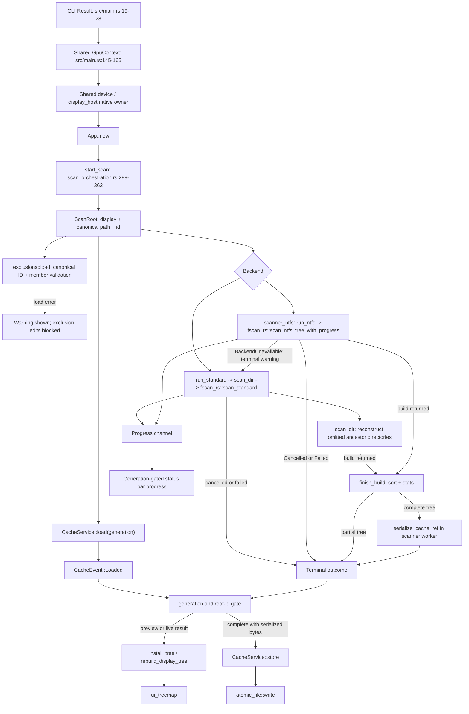
```mermaid
flowchart TD
    CLI["CLI Result: src/main.rs:19-28"] --> GPU["Shared GpuContext: src/main.rs:145-165"]
    GPU --> Eframe["Shared device / display_host native owner"]
    Eframe --> App["App::new"]
    App --> Start["start_scan: scan_orchestration.rs:299-362"]
    Start --> Root["ScanRoot: display + canonical path + id"]
    Root --> Exclusions["exclusions::load: canonical ID + member validation"]
    Exclusions -->|load error| Warning["Warning shown; exclusion edits blocked"]
    Root --> CacheCmd["CacheService::load(generation)"]
    Root --> Select{"Backend"}
    Select --> Standard["run_standard -> scan_dir -> fscan_rs::scan_standard"]
    Select --> NTFS["scanner_ntfs::run_ntfs -> fscan_rs::scan_ntfs_tree_with_progress"]
    NTFS -->|BackendUnavailable; terminal warning| Standard
    Standard --> Ancestors["scan_dir: reconstruct omitted ancestor directories"]
    Ancestors -->|build returned| Build["finish_build: sort + stats"]
    NTFS -->|build returned| Build
    Standard -->|cancelled or failed| Terminal["Terminal outcome"]
    NTFS -->|Cancelled or Failed| Terminal
    Build -->|complete tree| Serialize["serialize_cache_ref in scanner worker"]
    Build -->|partial tree| Terminal
    Serialize --> Terminal
    Standard --> Progress["Progress channel"]
    NTFS --> Progress
    CacheCmd --> CacheEvent["CacheEvent::Loaded"]
    CacheEvent --> Gate["generation and root-id gate"]
    Progress --> UIStatus["Generation-gated status bar progress"]
    Terminal --> Gate
    Gate -->|preview or live result| Install["install_tree / rebuild_display_tree"]
    Gate -->|complete with serialized bytes| Store["CacheService::store"]
    Store --> Atomic["atomic_file::write"]
    Install --> UI["ui_treemap"]
```

Cache I/O is owned by an ordered worker with per-root generation watermarks (`src/cache.rs:107-124,174-245`). Only complete scans queue a cache store (`src/app/scan_orchestration.rs:237-250`). Standard traversal reconstructs parents missing from walker callbacks before assembling the partial tree (`src/scanner.rs:302,315-366,432-440`); the NTFS adapter converts the `fscan-rs` tree into owned `DirEntry` nodes (`src/scanner_ntfs.rs:62-150`).

## Scan and cache sequence

```mermaid
sequenceDiagram
    participant UI as App UI
    participant CS as CacheService
    participant SW as Scan worker
    participant FS as Filesystem
    UI->>UI: Retire old scan, advance generation, clear presentation
    UI->>UI: Load exclusions; show warning and block edits on error
    UI->>CS: Load(generation, ScanRoot)
    UI->>SW: spawn(generation, root, backend)
    CS->>FS: Read and validate flat cache
    CS-->>UI: Loaded(generation, root_id, result)
    UI->>UI: Gate by generation/root_id; optional preview
    SW->>FS: fscan-rs standard or NTFS MFT
    opt NTFS BackendUnavailable
        SW-->>UI: NtfsFallback on terminal channel
        SW->>FS: Standard scanner fallback
    end
    opt NTFS Cancelled or Failed
        Note over SW: No standard fallback
    end
    SW-->>UI: Progress (bounded channel)
    opt A build returned
        SW->>SW: Sort tree and compute stats
        opt Complete tree
            SW->>SW: Serialize cache bytes
        end
    end
    SW-->>UI: Terminal(Completed/Partial/Cancelled/Failed)
    UI->>UI: Gate and install live tree
    opt Completed with serialized bytes
        UI->>CS: Store(generation, root, bytes)
        CS->>FS: Atomic cache replacement
        CS-->>UI: Stored(result)
    end
```

## Rendering and readback branches

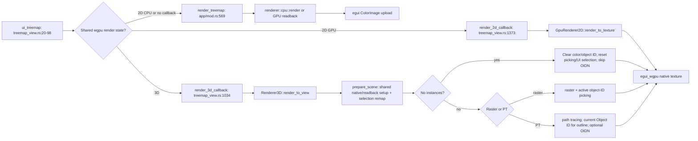
```mermaid
flowchart LR
    UI["ui_treemap: treemap_view.rs:20-98"] --> Select{"Shared wgpu render state?"}
    Select -->|2D CPU or no callback| Legacy["render_treemap: app/mod.rs:569"]
    Select -->|2D GPU| GPU2D["render_2d_callback: treemap_view.rs:1373"]
    Select -->|3D| GPU3D["render_3d_callback: treemap_view.rs:1034"]
    Legacy --> CPU["renderer::cpu::render or GPU readback"]
    CPU --> Upload["egui ColorImage upload"]
    GPU2D --> Native2D["GpuRenderer2D::render_to_texture"]
    Native2D --> EguiNative["egui_wgpu native texture"]
    GPU3D --> View["Renderer3D::render_to_view"]
    View --> Prepare["prepare_scene: shared native/readback setup + selection remap"]
    Prepare --> Empty{"No instances?"}
    Empty -->|yes| Clear["Clear color/object ID; reset picking/UI selection; skip OIDN"]
    Empty -->|no| Raster{"Raster or PT"}
    Clear --> EguiNative
    Raster -->|raster| Pass["raster + active object-ID picking"]
    Raster -->|PT| Trace["path tracing; current Object ID for outline; optional OIDN"]
    Pass --> EguiNative
    Trace --> EguiNative
```

Shift-drag selection keeps path identity across instance rebuilds (`src/app/treemap_view.rs:412-458,729-767`; `src/app/scan_orchestration.rs:91-111`). CPU fallback picking calls `Renderer3D::screen_ray`, which applies the camera's reversed-Z near/far convention (`crates/render-3d/src/renderer3d/cpu_pick.rs:29-58`; `crates/render-3d/src/lib.rs:1343-1378`).

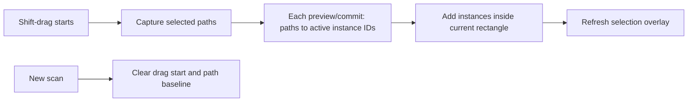
```mermaid
flowchart LR
    Drag["Shift-drag starts"] --> Baseline["Capture selected paths"]
    Baseline --> Remap["Each preview/commit: paths to active instance IDs"]
    Remap --> Inside["Add instances inside current rectangle"]
    Inside --> Overlay["Refresh selection overlay"]
    NewScan["New scan"] --> Reset["Clear drag start and path baseline"]
```

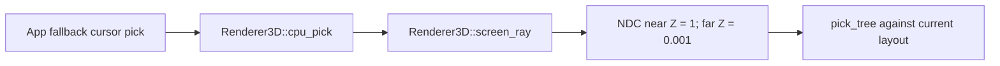
```mermaid
flowchart LR
    Cursor["App fallback cursor pick"] --> Pick["Renderer3D::cpu_pick"]
    Pick --> Ray["Renderer3D::screen_ray"]
    Ray --> Near["NDC near Z = 1; far Z = 0.001"]
    Near --> Tree["pick_tree against current layout"]
```

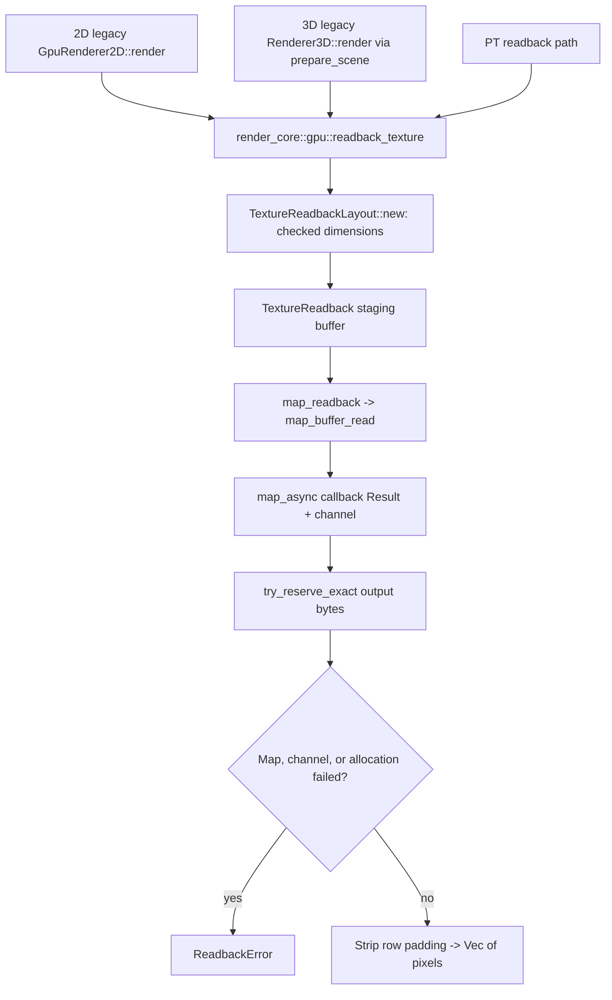
```mermaid
flowchart TD
    T2D["2D legacy GpuRenderer2D::render"] --> Copy["render_core::gpu::readback_texture"]
    R3D["3D legacy Renderer3D::render via prepare_scene"] --> Copy
    PT["PT readback path"] --> Copy
    Copy --> Layout["TextureReadbackLayout::new: checked dimensions"]
    Layout --> Stage["TextureReadback staging buffer"]
    Stage --> Map["map_readback -> map_buffer_read"]
    Map --> Callback["map_async callback Result + channel"]
    Callback --> Reserve["try_reserve_exact output bytes"]
    Reserve --> Error{"Map, channel, or allocation failed?"}
    Error -->|yes| ResultErr["ReadbackError"]
    Error -->|no| Pixels["Strip row padding -> Vec of pixels"]
```

The older double-`unwrap` panic diagram is obsolete: `map_buffer_read` returns typed errors, and output allocation is fallible (`crates/render-core/src/lib.rs:740-805,807-839`).

## Screenshot and media codepaths

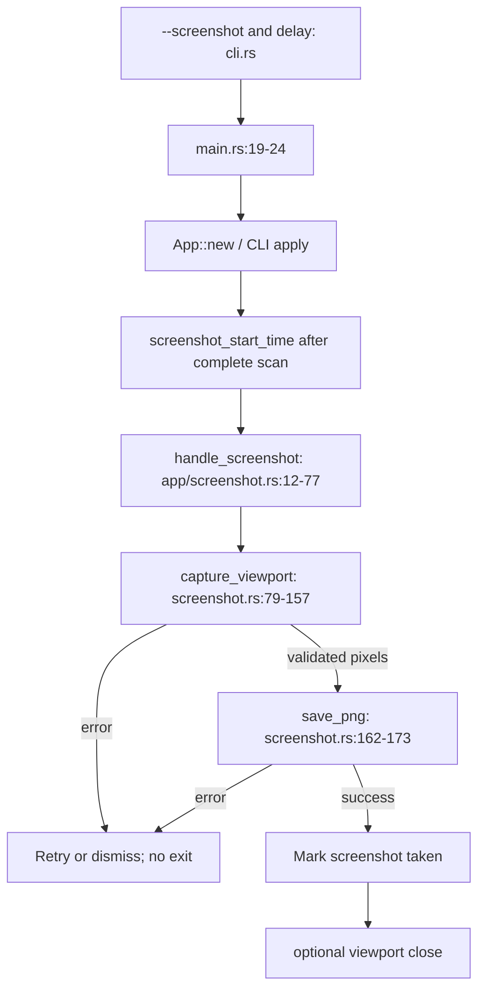
```mermaid
flowchart TD
    Args["--screenshot and delay: cli.rs"] --> Main["main.rs:19-24"]
    Main --> App["App::new / CLI apply"]
    App --> Timer["screenshot_start_time after complete scan"]
    Timer --> Maybe["handle_screenshot: app/screenshot.rs:12-77"]
    Maybe --> Capture["capture_viewport: screenshot.rs:79-157"]
    Capture -->|validated pixels| Save["save_png: screenshot.rs:162-173"]
    Capture -->|error| Failure["Retry or dismiss; no exit"]
    Save -->|error| Failure
    Save -->|success| Done["Mark screenshot taken"]
    Done --> Exit["optional viewport close"]
```

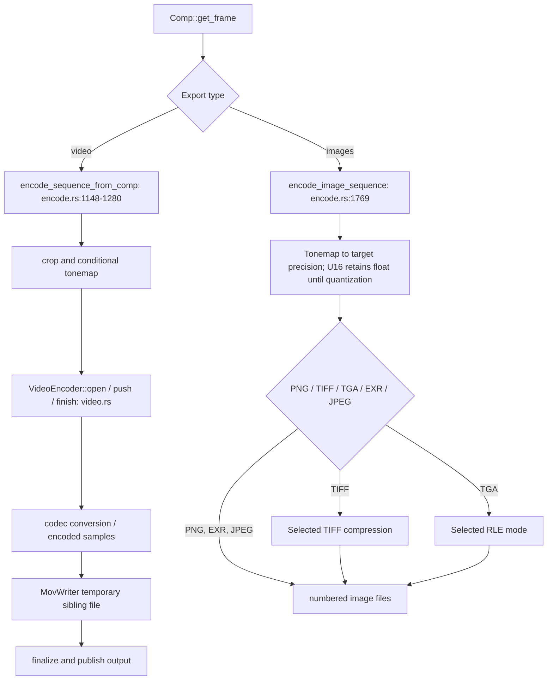
```mermaid
flowchart TD
    Comp["Comp::get_frame"] --> Choice{"Export type"}
    Choice -->|video| Video["encode_sequence_from_comp: encode.rs:1148-1280"]
    Video --> Crop["crop and conditional tonemap"]
    Crop --> Encoder["VideoEncoder::open / push / finish: video.rs"]
    Encoder --> Convert["codec conversion / encoded samples"]
    Convert --> Mux["MovWriter temporary sibling file"]
    Mux --> Commit["finalize and publish output"]
    Choice -->|images| Sequence["encode_image_sequence: encode.rs:1769"]
    Sequence --> Tone["Tonemap to target precision; U16 retains float until quantization"]
    Tone --> Writer{"PNG / TIFF / TGA / EXR / JPEG"}
    Writer -->|TIFF| Tiff["Selected TIFF compression"]
    Writer -->|TGA| Tga["Selected RLE mode"]
    Writer -->|PNG, EXR, JPEG| Frames["numbered image files"]
    Tiff --> Frames
    Tga --> Frames
```

The image-sequence writer now routes selected TIFF and TGA compression to their encoders (`crates/media-encoder/src/dialogs/encode/encode.rs:1664-1680,1718-1762`). App capture supplies RGBA8 (`src/app/image_sequence.rs:257-267`), so its U16 export cannot recover higher source precision.

## OIDN progressive preview and numerical dataflow — 2026-10-02

The audited bridge is described in [plan16.md](plan16.md) and [the source report](../oidn-rs/bughunt/squarebob_bridge.md). These diagrams describe checked code, including open defects; they do not identify the measured noise cause.

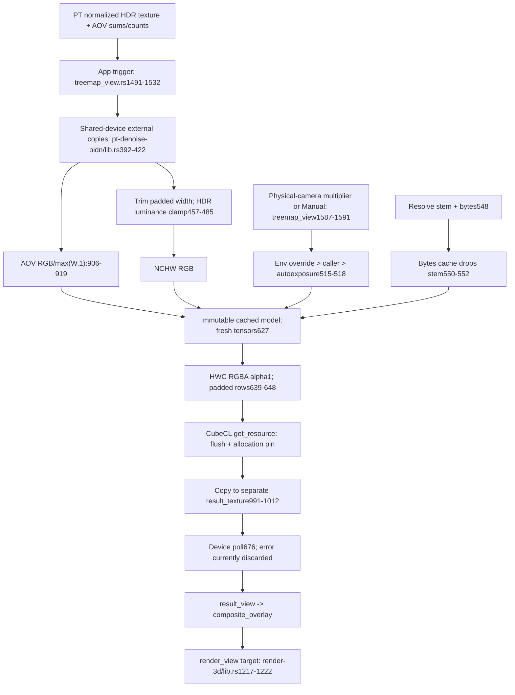
```mermaid
flowchart TD
    PT["PT normalized HDR texture + AOV sums/counts"] --> Trigger["App trigger: treemap_view.rs1491-1532"]
    Trigger --> Copy["Shared-device external copies: pt-denoise-oidn/lib.rs392-422"]
    Copy --> RGB["Trim padded width; HDR luminance clamp457-485"]
    Copy --> AOV["AOV RGB/max(W,1):906-919"]
    RGB --> CHW["NCHW RGB"]
    AOV --> Net["Immutable cached model; fresh tensors627"]
    CHW --> Net
    Camera["Physical-camera multiplier or Manual: treemap_view1587-1591"] --> Scale["Env override > caller > autoexposure515-518"]
    Scale --> Net
    Weight["Resolve stem + bytes548"] --> Cache["Bytes cache drops stem550-552"]
    Cache --> Net
    Net --> Out["HWC RGBA alpha1; padded rows639-648"]
    Out --> Resource["CubeCL get_resource: flush + allocation pin"]
    Resource --> Result["Copy to separate result_texture991-1012"]
    Result --> Poll["Device poll676; error currently discarded"]
    Poll --> View["result_view -> composite_overlay"]
    View --> Display["render_view target: render-3d/lib.rs1217-1222"]
```

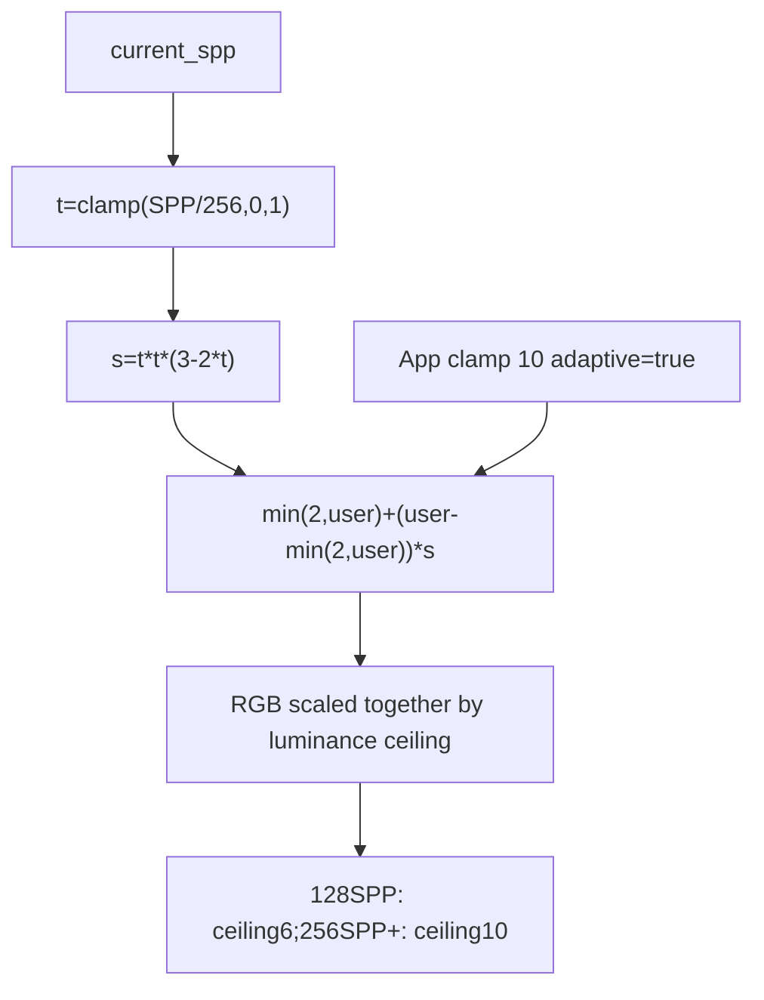
```mermaid
flowchart TD
    SPP["current_spp"] --> Time["t=clamp(SPP/256,0,1)"]
    Time --> Smooth["s=t*t*(3-2*t)"]
    Smooth --> Clamp["min(2,user)+(user-min(2,user))*s"]
    User["App clamp 10 adaptive=true"] --> Clamp
    Clamp --> Input["RGB scaled together by luminance ceiling"]
    Input --> Preview["128SPP: ceiling6;256SPP+: ceiling10"]
```

The ceiling changes for early default previews even with identical raw inputs (`crates/pt-denoise-oidn/src/lib.rs:457-470`). It is constant after 256 SPP. A frozen-input test with fixed versus adaptive clamp separates this policy from raw renderer changes.

```mermaid
sequenceDiagram
    participant PT as PT samples
    participant App as App scheduler
    participant OIDN as OIDN bridge
    PT->>App:128SPP, target 300, interval 128
    App->>OIDN:Periodic pass
    OIDN-->>App:Success; any-denoise flag=true, last=128
    PT->>App:256SPP
    App->>OIDN:Periodic pass
    OIDN-->>App:Success; any-denoise flag=true, last=256
    PT->>App:Final300SPP
    Note over App: auto_final false because flag=true; periodic delta44<128
    Note over App,OIDN: No final pass; displayed denoised snapshot remains256SPP
```

The final scheduling defect is checked at `src/app/treemap_view.rs:1510-1522,1609-1612`. The proposed repaired state tracks successfully denoisedSPP and accumulation identity, with final completion separate from earlier preview success. This proposal is awaiting production approval.

Verification follow-up: the synthetic GPU probe and 32 fixed-input repeats passed, as did workspace compilation and actual squarebob binary linking. No actual-scene noise reproduction or native numerical parity result is asserted. Exact commands, logs, and device limits are in [Squarebob plan16](plan16.md).

## Native measurements and shared PQ presentation follow-up

[Native runtime report](../oidn-rs/bughunt/native_runtime.md) records 90 successful finite synthetic runs and all 23 archive byte matches. Earlier missing-asset/no-runtime statements are historical. Aligned explicit-scale CPU/WGPU results are close; unaligned AOV and odd/tiny exposure are separate measured defects. The checker SD change measures restored contrast, not error against a clean target. See [Astra numerics](../oidn-rs/bughunt/astra_numerics.md).

The following display source is implemented under explicit PQ authorization; final actual-window/color/shader validation remains tracked in [Squarebob plan17](../squarebob-rs/plan17.md).

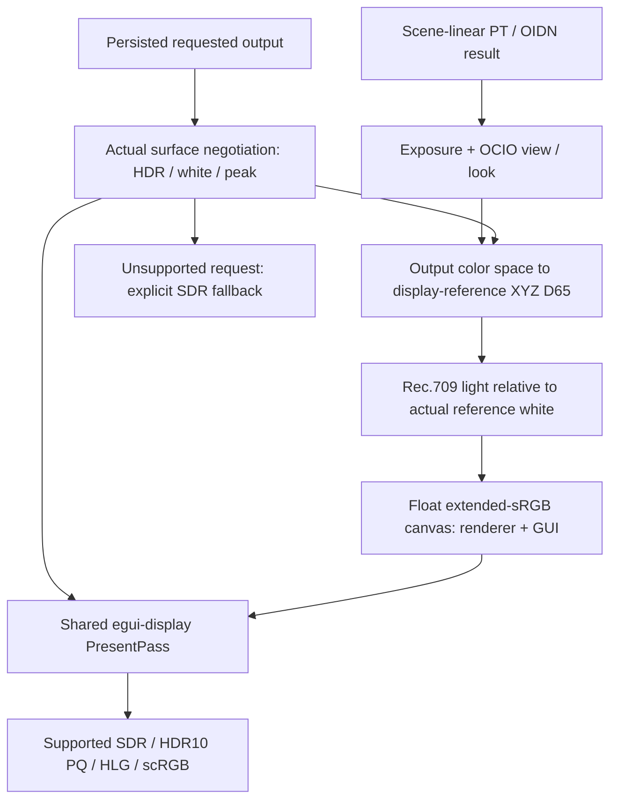
```mermaid
flowchart TB
    Raw["Scene-linear PT / OIDN result"] --> View["Exposure + OCIO view / look"]
    View --> Decode["Output color space to display-reference XYZ D65"]
    Decode --> Light["Rec.709 light relative to actual reference white"]
    Light --> Canvas["Float extended-sRGB canvas: renderer + GUI"]
    State["Actual surface negotiation: HDR / white / peak"] --> Decode
    State --> Present["Shared egui-display PresentPass"]
    Canvas --> Present
    Present --> Surface["Supported SDR / HDR10 PQ / HLG / scRGB"]
    Request["Persisted requested output"] --> State
    State --> Fallback["Unsupported request: explicit SDR fallback"]
```

PQ encoding belongs only to the shared presenter (`present.rs:127-149,202-215,766` at locked egui-widgets revision06acf665). Source anchors: Squarebob `display_host.rs:309-310,389-455,520-584`; color pipeline `lib.rs:772-808`. This diagram does not claim measured physical display luminance or reproduction of the user's scene. OIDN's PU transfer is unrelated to display PQ and remains a separate inference contract.

## CPU display source ownership after authorized repair

Earlier bridge diagrams covered GPU composition. CPU display now uses the same shared composition entry point for raw and denoised sources; it does not overwrite either raw source. See [Squarebob plan17](../squarebob-rs/plan17.md) and [Astra post-fix review](../oidn-rs/bughunt/astra_pq_review.md).

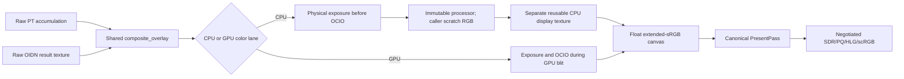
```mermaid
flowchart LR
    PT["Raw PT accumulation"] --> Shared["Shared composite_overlay"]
    OIDN["Raw OIDN result texture"] --> Shared
    Shared --> Lane{"CPU or GPU color lane"}
    Lane -->|CPU| Exposure["Physical exposure before OCIO"]
    Exposure --> Processor["Immutable processor; caller scratch RGB"]
    Processor --> Scratch["Separate reusable CPU display texture"]
    Lane -->|GPU| Blit["Exposure and OCIO during GPU blit"]
    Scratch --> Canvas["Float extended-sRGB canvas"]
    Blit --> Canvas
    Canvas --> Present["Canonical PresentPass"]
    Present --> Surface["Negotiated SDR/PQ/HLG/scRGB"]
```

CPU immutability/order and bounded full-PresentPass signal tests passed; actual GUI retry and main push remain pending. This does not resolve the user's scene noise cause or authorize unrelated denoiser repairs.

## Final verified persistence and output state

Actual PBR/PT GPU/PT CPU windows and CPU-state restart passed; actual output is HDR10(PQ), Rgb10a2Unorm/Bt2100Pq. This supersedes preceding pending-GUI notes. Main publication is explicitly authorized; receipt belongs in OIDN plan3. Multi-monitor/manual lifecycle and physical luminance remain unverified.

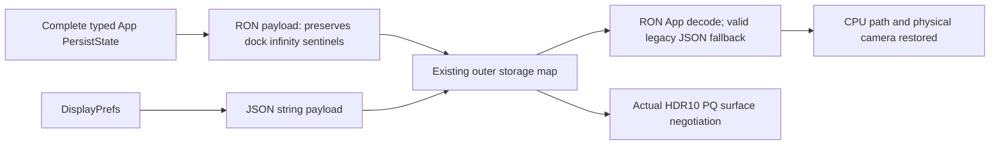
```mermaid
flowchart LR
    App["Complete typed App PersistState"] --> RON["RON payload: preserves dock infinity sentinels"]
    Display["DisplayPrefs"] --> JSON["JSON string payload"]
    RON --> Map["Existing outer storage map"]
    JSON --> Map
    Map --> Restore["RON App decode; valid legacy JSON fallback"]
    Restore --> CPU["CPU path and physical camera restored"]
    Map --> Negotiation["Actual HDR10 PQ surface negotiation"]
```
