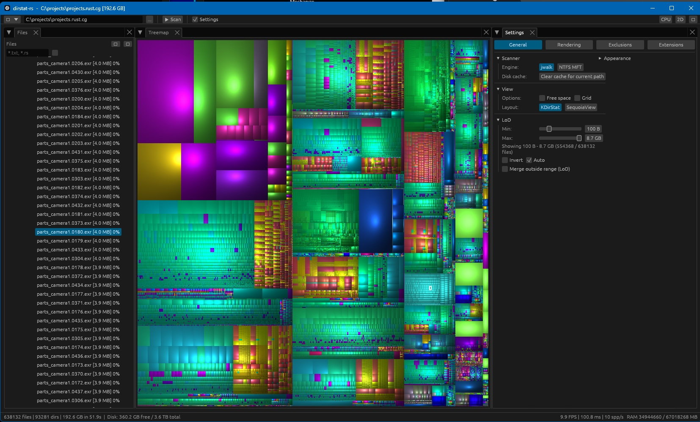
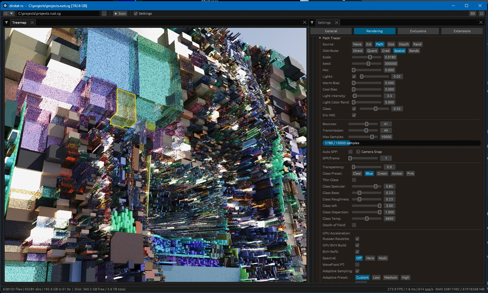

# Squarebob

Squarebob is a Rust disk usage visualizer with fast directory scanning, a 2D treemap, a real-time 3D treemap renderer, GPU path tracing experiments, and an integrated media export dialog.
It is inspired by tools like SequoiaView, WinDirStat and KDirStat, but the renderer and UI are built from scratch around `egui`, `wgpu`, and a modular Rust workspace.



<video src=https://github.com/user-attachments/assets/0dbd5b81-f529-4d05-b7ad-19922f156f69>Squarebob-encoded media</video>

## Highlights

- 2D treemap with CPU and GPU rendering backends.
- 3D treemap made from file and folder cubes with depth, materials, hover feedback, and selection.
- Progressive GPU path tracing with BVH acceleration, denoising, spectral options, adaptive sampling, ReSTIR/path-guiding experiments, and wavefront infrastructure.
- Parallel directory scanning via `jwalk`.
- Optional NTFS MFT scanner on Windows for faster scans when permissions allow it.
- Dockable `egui_dock` UI: tree, treemap, extensions, settings, and floating encode dialog.
- Reusable `media-encoder` crate for video and image sequence export.
- Built-in render defaults from `data/factory_render3d_options.json`, with optional runtime override via `default.json` next to the executable.
- Cross-platform CI for Linux, Windows, and macOS, with manual packaging and tagged releases.

## Screens

The main UI consists of Viewport in the middle, TreeView in the left panel and Settings at the right side.

- Top toolbar: path entry, scan controls, theme toggle, encode toggle (`E`), 2D/3D switch, and 2D CPU/GPU switch.
- Left/right dock panels: file tree, extension statistics, renderer settings, scanner settings, and other tools.
- Central viewport: 2D treemap or 3D scene.
- Encode dialog: floating window driven by the reusable `media-encoder` crate.

## Rendering Status

The renderer has been the main area of recent work. The current direction is a split between a stable interactive raster view and experimental path-traced views that share the same scene, material, camera, and UI state.

### 2D Renderer

The 2D treemap has both CPU and GPU paths:

- CPU path remains available for fallback and screenshot/readback flows.
- GPU path now renders directly into a texture that `egui_wgpu` can sample.
- The old CPU readback route is no longer the primary display path for 2D GPU mode.
- `render_2d_callback` mirrors the 3D callback path, so both 2D GPU and 3D views use native texture registration.

What this fixed:

- Removed unnecessary CPU round-trips from the normal 2D GPU display path.
- Made the denoiser/display integration path reusable across 2D GPU and 3D/PT output.
- Kept screenshots and foreign-`GpuContext` cases on the safer readback fallback path.

### 3D Raster Renderer

The 3D mode renders the disk tree as instanced cubes. File size, depth, age, extension, path, and folder hierarchy can drive height, color, materials, and effects.

Current features:

- PBR-style shaded cubes.
- Wireframe mode.
- Hover/selection highlighting.
- Environment map support.
- Slice plane controls.
- LOD controls.
- Camera orbit/pan/zoom with inertia.
- Per-mode height curves and color ramps.
- Per-effect animation strength and speed.

Recent improvements:

- Cube placement was changed to center cubes on the treemap plane. Earlier extrusion toward the camera made tall file cubes swallow the camera and caused severe slowdowns in large scenes.
- Height settings are now stored per `CubeHeightMode`, so switching between size/depth/constant modes no longer leaks a bad scale into another mode.
- Color and folder tint settings are now stored per mode through shared ramp parameters.
- Renderer settings were regrouped into collapsible sections so complex 3D controls are easier to scan.

### Materials And Palettes

Material handling was moved toward data-driven, reusable crates:

- `pt-mats` owns material classification, material libraries, palettes, and materialization settings.
- `render-shared::viz` provides reusable `CurveParams`, `RampParams`, and `Mapping<P, N>` storage.
- Palette ramps replaced coarse hash bins for ordered data like file size, file age, and depth.

Available palette families include:

- Viridis
- Magma
- Plasma
- Turbo
- Sunset
- Cubehelix

What this achieved:

- Size, age, and depth now produce continuous gradients instead of noisy hash-binned colors.
- File/path colors remain deterministic, but sibling paths cluster more naturally.
- Material settings survive mode switches without losing per-mode tuning.
- The material library now supports legacy slots plus dense palette samples for smoother material/color assignment.

### Path Tracing

Path tracing is integrated into 3D mode and can use either a megakernel backend or the wavefront backend.

Implemented PT features include:

- Progressive accumulation.
- CPU BVH fallback and GPU LBVH build path.
- Optional BVH refit for animated scenes.
- Environment lighting and environment importance sampling.
- Emissive material sampling.
- Russian roulette.
- Depth of field.
- Spectral mode hooks.
- Adaptive sampling.
- ReSTIR DI/GI plumbing and live megakernel ReSTIR-DI.
- Path guiding hooks.
- Intel Open Image Denoise (OIDN) integration via the local `pt-denoise-oidn` crate, with color / +albedo / +albedo+normal modes.
- Wavefront tiled backend.

Recent fixes and outcomes:

- Selection clicks no longer reset path-tracing accumulation. Clicking a cube now updates selection state without forcing a full scene/layout rebuild.
- The animation timeline now uses a wall-clock anchor with a clamped delta, preventing large jumps after idle/resume.
- The master animation toggle now freezes cube animation and environment animation consistently.
- Emissive light sampling was changed from linear scan to an O(1) Vose alias table. Scenes with thousands of light cubes are no longer dominated by per-sample light picking.
- PT scene buffers are now grow-only and updated with `queue.write_buffer` when capacity is sufficient, reducing buffer churn.
- Megakernel/ReSTIR/pathguide bind groups are rebuilt only when backing resources actually change.
- The GPU BVH traversal stack was increased from 32 to 64 entries, fixing flickering holes where the sky leaked through dense cube scenes during camera motion.
- GPU BVH refit now keeps a persistent output-node buffer and can update animated AABBs without a full radix/LBVH rebuild every frame.

### Wavefront PT Work

The wavefront backend is still experimental, but several correctness issues were fixed.

Important fixes:

- Fixed the tile-state race where only the bottom-right tile rendered correctly and other tiles were black/noisy.
- Replaced single shared tile buffers with per-tile dynamic-offset buffers.
- Removed per-tile `queue.write_buffer` calls from the tile loop; tile state is packed once and selected through dynamic offsets.
- Added tile-size safety clamps so transient UI edits like typing `256` do not briefly create hundreds of thousands of tiny tiles.
- Spectral mode no longer silently forces the megakernel backend; wavefront spectral tinting now runs through the selected backend.
- Adaptive sampling, path guiding, G-buffer, and ReSTIR passes now use global pixel IDs where needed, so tiled rendering does not alias full-image buffers.
- ReSTIR motion vectors now keep a coherent previous/current view-projection pair instead of always seeing zero motion.

What this achieved:

- Wavefront PT is no longer limited to a visibly broken single-tile result.
- Advanced wavefront subsystems can coexist with tiling instead of being force-disabled.
- The per-tile buffer packing helper is reusable from downstream crates.

### Known Render Follow-Ups

The renderer is usable, but some PT areas are still research-grade:

- ReSTIR temporal/spatial quality still needs more visual tuning.
- Extreme animated scenes may still need a threshold that falls back from BVH refit to full rebuild.
- Age-based color currently uses deterministic fallback data unless real modification-time plumbing is available from the scanner.

## Usage

Run the app without arguments to open the GUI:

```powershell
cargo run -p squarebob-rs
```

Scan a path on startup:

```powershell
cargo run -p squarebob-rs -- C:\Users
```

Start directly in 3D:

```powershell
cargo run -p squarebob-rs -- --mode 3d C:\Users
```

Enable path tracing from the command line:

```powershell
cargo run -p squarebob-rs -- --mode 3d --path-trace --samples 64 C:\Users
```

Print all CLI options:

```powershell
cargo run -p squarebob-rs -- --help
```

Useful CLI groups include:

- `--mode 2d|3d`
- `--backend cpu|gpu` for 2D mode
- `--path-trace`, `--no-path-trace`
- `--wavefront`, `--no-wavefront`
- `--bounces`, `--samples`, `--pt-spp`
- `--pt-gpu-bvh`, `--pt-bvh-refit`
- `--pt-denoise`, `--pt-adaptive-sampling`
- `--pt-restir-*`, `--pt-path-guiding`
- `--env-map`, `--env-path`, `--env-intensity`
- `--screenshot`, `--screenshot-path`, `--exit-after-screenshot`

## Render Presets

The default 3D/render preset is compiled into the binary from:

```text
data/factory_render3d_options.json
```

At runtime, Squarebob first looks for this file next to the executable:

```text
default.json
```

If that adjacent file exists and parses as `Render3DOptions`, it becomes the default preset. If it is missing or invalid, the app falls back to the bundled factory preset.

Named user presets are stored under the app data directory in a `presets/` folder. The reserved built-in preset name is:

```text
defaults
```

## Encoding

Squarebob includes a reusable `media-encoder` crate and wires it into the main app through the `E` button in the top-right toolbar.

Supported export modes:

- Video export
- Image sequence export

Video containers:

- MP4
- MOV

Video codecs:

- H.264
- H.265 / HEVC
- AV1
- ProRes

Encoder modes:

- Auto: hardware encoder first, CPU fallback
- Hardware only
- Software only

Image sequence formats:

- EXR
- PNG
- JPEG
- TIFF
- TGA

EXR support is provided through `vfx-rs` (`vfx-core`, `vfx-exr`, `vfx-io`) and supports common OpenEXR compression modes including ZIP, PIZ, PXR24, B44/B44A, DWA, and HTJ2K variants. FFmpeg integration is provided by the git dependency `playa-ffmpeg`.

The encoder captures the current Squarebob viewport frame-by-frame. For 3D path tracing, it waits for the configured sample target before handing a frame to the encoder.

## Local Development

The preferred local entry point is `bootstrap.py` or `xtask`, not raw `cargo build`, because FFmpeg/native dependencies require a configured vcpkg environment.

Common commands:

```powershell
python bootstrap.py b          # release build through xtask
python bootstrap.py b -d       # debug build
python bootstrap.py t -d       # debug tests
python bootstrap.py c          # fmt check + clippy through xtask
python bootstrap.py deps       # install pinned vcpkg dependencies
python bootstrap.py pkg        # cargo-packager package
```

Equivalent xtask commands:

```powershell
cargo run -p xtask -- build --debug
cargo run -p xtask -- build --release
cargo run -p xtask -- check
cargo run -p xtask -- clippy --workspace --all-targets -- -D warnings
cargo run -p xtask -- test --debug
cargo run -p xtask -- wipe
```

On Windows this repository expects vcpkg at:

```text
C:\vcpkg
```

The pinned vcpkg manifest is:

```text
vcpkg.json
vcpkg-configuration.json
```

The active triplets used by CI/local bootstrap are:

- Windows: `x64-windows-static-md-release`
- Linux: `x64-linux-release`
- macOS Apple Silicon: `arm64-osx-release`

## Requirements

- Rust 1.95.0, pinned by `rust-toolchain.toml`.
- Python 3 for `bootstrap.py`.
- vcpkg for FFmpeg/native media dependencies.
- A GPU/backend supported by `wgpu`:
  - Windows: DirectX 12
  - Linux: Vulkan/Wayland/X11 stack
  - macOS: Metal
- On Windows, Visual Studio C++ build tools for native builds.

The NTFS MFT scanner is Windows-only and may require elevated permissions. If it cannot be used, the app falls back to the standard scanner.

## Packaging

Packaging is handled with `cargo-packager` plus platform-specific signing/installer steps in GitHub Actions.

Configured package formats:

- Linux: `.deb`
- Windows: NSIS installer
- macOS: `.app`, then signed/notarized `.dmg`

Local package attempt:

```powershell
python bootstrap.py pkg
```

Manual GitHub packaging:

```powershell
gh workflow run "CI/CD" --ref main -f package=true -f package_platform=all
```

Package one platform:

```powershell
gh workflow run "CI/CD" --ref main -f package=true -f package_platform=macos
gh workflow run "CI/CD" --ref main -f package=true -f package_platform=windows
gh workflow run "CI/CD" --ref main -f package=true -f package_platform=linux
```

Manual packaging uploads artifacts to the workflow run. It does not create a GitHub Release.

## CI/CD

Workflow:

```text
.github/workflows/ci.yml
```

Shared native dependency setup:

```text
.github/actions/setup-native-deps/action.yml
```

Behavior:

- Pull requests and pushes to `main` run verify on Linux, Windows, and macOS.
- Verify installs Rust + Clippy, restores caches, runs workspace clippy, and runs workspace tests through `xtask`.
- Manual `workflow_dispatch` with `package=true` skips verify and runs packaging for the selected platform(s).
- Tags matching `v*` run verify, package, and publish GitHub Release assets.
- `concurrency.cancel-in-progress` is enabled so a newer run on the same ref cancels older runs.

Required GitHub secrets for signed macOS release builds:

- `APPLE_CERTIFICATE_P12`
- `APPLE_CERTIFICATE_PASSWORD`
- `APPLE_API_ISSUER_ID`
- `APPLE_API_KEY_ID`
- `APPLE_API_KEY_P8`
- `APPLE_TEAM_ID`

## Workspace Layout

```text
.
|-- src/                         Main Squarebob app and egui integration
|   |-- app/                     App state, dock UI, toolbar, scanning, presets, encode adapter
|   |-- cli.rs                   Command-line parser
|   |-- scanner.rs               Standard parallel scanner
|   |-- scanner_ntfs.rs          Windows NTFS MFT scanner
|   `-- main.rs                  Binary entry point
|-- crates/
|   |-- squarebob-core             Shared tree/data structures
|   |-- treemap                  2D treemap layout and GPU 2D renderer
|   |-- render-core              Shared GPU context/readback utilities
|   |-- render-shared            Shared 3D options, camera, uniforms, visualization parameters
|   |-- render-3d                3D renderer, picking, environment, path-tracing integration
|   |-- pt-core                  Path tracing shared types
|   |-- pt-mats                  Materials, palettes, and material classification
|   |-- pt-megakernel            Megakernel path tracer compute backend
|   |-- pt-wavefront             Wavefront path tracing infrastructure
|   |-- bvh-gpu                  GPU BVH construction/refit
|   |-- media-encoder            Reusable encode dialog and media export implementation
|   `-- xtask                    Build/test/release automation
|-- data/                        Screenshots and bundled factory render preset
|-- shaders/                     Shader resources used by render paths
|-- bootstrap.py                 Cross-platform local helper script
|-- vcpkg.json                   Native FFmpeg dependency manifest
`-- .github/                     CI/CD workflows and composite actions
```

## Stack

| Area | Main crates/tools | Version / source |
| --- | --- | --- |
| Rust toolchain | `rustc`, `cargo`, `clippy` | `1.95.0` via `rust-toolchain.toml` |
| UI shell | `egui`, `egui-wgpu`, `eframe` | `0.34` |
| Docking | `egui_dock` | `0.19` with `serde` |
| Icons | `egui-phosphor` | `0.12.0` |
| GPU | `wgpu` | `29` |
| Math / GPU data | `glam`, `bytemuck`, `half` | `0.32`, `1`, `2.7.x` |
| 2D treemap | local `treemap` crate | workspace `0.1.0`, optional `wgpu` feature |
| 3D renderer | local `render-3d`, `render-shared`, `render-core` crates | workspace `0.1.0` |
| Path tracing | local `pt-core`, `pt-megakernel`, `pt-wavefront`, `pt-mats`, `bvh-gpu` crates | workspace `0.1.0` |
| Scanning | `jwalk`, `rayon`, `windows` | `0.8`, `1.12`, `0.62` |
| App services | `directories`, `rfd`, `open`, `trash`, `sysinfo` | `6`, `0.17`, `5`, `5`, `0.38` |
| Serialization/cache | `serde`, `serde_json`, `bincode`, `sha2` | `1`, `1`, `1`, `0.11` |
| Images | `image` | `0.25` with PNG/JPEG/TIFF/TGA/HDR features in `media-encoder` |
| Media export | local `media-encoder` crate | workspace `0.1.0`, Rust edition 2024 |
| FFmpeg binding | `playa-ffmpeg` | git: `https://github.com/ssoj13/playa-ffmpeg` |
| EXR/VFX IO | `vfx-core`, `vfx-exr`, `vfx-io` | git: `https://github.com/ssoj13/vfx-rs.git`, `main` |
| Native deps | FFmpeg via vcpkg | baseline pinned in `vcpkg-configuration.json` |
| Packaging | `cargo-packager` | `0.11.7` in `bootstrap.py`, GitHub Actions installs with `cargo install cargo-packager --locked` |

## License

MIT
