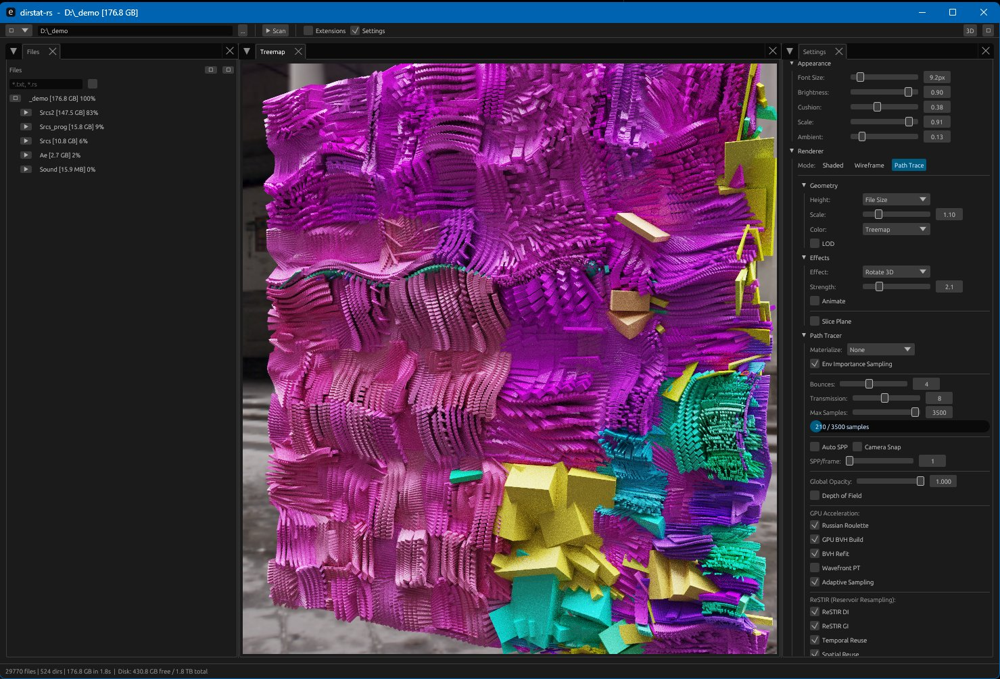

# dirstat-rs

Fast disk usage visualizer with squarified cushion treemap and real-time 3D rendering.
Rust version from scratch inspired by WinDirStat/SequoiaView...with WGPU PathTracer on top.



## Features

### Visualization
- **2D Treemap** - Squarified cushion shading with KDirStat and SequoiaView layout styles
- **3D Mode** - Real-time GPU-rendered cubes with proper depth, lighting, and materials
- **Path Tracer** - Progressive GPU path tracing with BVH acceleration, soft shadows, DoF
- **Hash Effects** - Wave, twist, spiral transforms for visual exploration
- **Environment Maps** - HDR/EXR skybox lighting in 3D mode

### Scanning
- **Parallel Scanner** - jwalk with rayon thread pool for fast traversal
- **NTFS MFT Scanner** - Direct MFT reading on Windows (admin), 10x faster on large drives
- **Scan Caching** - Results cached to disk, instant reload on revisit
- **Auto-fallback** - NTFS scanner falls back to standard on permission errors

### UI/UX
- **Dockable Panels** - File tree, treemap, extensions, settings - drag to rearrange
- **Virtual File Tree** - Handles millions of files with virtual scrolling
- **Extension Stats** - Color-coded breakdown by file type with sorting
- **Size Filter** - Min/max sliders with logarithmic scale, invert option
- **Exclusions** - Right-click to exclude paths, persisted between sessions
- **Zoom/Pan** - Double-click to zoom into directories, scroll to zoom, drag to pan
- **3D Camera** - Houdini-style orbit (LMB), pan (MMB), zoom (RMB/scroll) with inertia
- **Hover Highlight** - Glow, outline, or both modes for 3D
- **Context Menu** - Reveal in Explorer, copy path, open terminal, delete to trash
- **Light/Dark Theme** - Toggle with single click
- **Persistent Settings** - All UI state saved between sessions

### Rendering (3D Mode)
- **Shaded** - PBR-style with roughness, metalness, alpha controls
- **Wireframe** - Edge visualization
- **Path Tracer** - Progressive accumulation with configurable bounces, SPP, DoF
- **Materials** - Assign materials by extension, path, size, age, or random
- **Color Modes** - Treemap, file type, age, size, or depth-based rainbow gradient
- **Height Modes** - Flat, logarithmic, square root, linear, or depth-squared
- **Environment** - HDR environment maps with intensity/rotation controls

## Keyboard Shortcuts

### Global
| Key | Action |
|-----|--------|
| `Backspace` | Zoom out one level |
| `Escape` | Reset zoom to root |
| `Delete` | Move selected to trash |
| `Ctrl+C` | Copy selected path |
| `Ctrl+F` | Search/filter files |
| `F5` | Rescan current path |

### 3D View
| Key | Action |
|-----|--------|
| `F` | Fit selection/hovered (zoom only) |
| `A` | Fit all (zoom to entire scene) |
| `H` | Home (reset camera to front view) |
| `LMB drag` | Orbit camera |
| `MMB drag` | Pan camera |
| `RMB drag` / `Scroll` | Zoom camera |

### File Tree
| Key | Action |
|-----|--------|
| `F` | Scroll to selected file |

## Build

```sh
cargo build --release
```

## Usage

```sh
# Launch GUI
dirstat-rs

# Auto-scan a path
dirstat-rs C:\Users

# Scan with NTFS MFT (Windows, requires admin)
dirstat-rs --ntfs C:\
```

## Requirements

- Rust 1.95+ (pinned via `rust-toolchain.toml`)
- GPU with Vulkan/DX12/Metal support (for 3D mode)
- Windows (for NTFS MFT scanner, optional)

## Architecture

```
src/
  main.rs              Entry point, CLI args
  app/                 UI modules
    mod.rs             Core app state, update loop
    dock.rs            Dockable panel layout
    settings/          Settings panel (modular)
    toolbar.rs         Top toolbar
    tree_panel.rs      File tree view
    treemap_view.rs    Central treemap/3D view
    ext_panel.rs       Extension statistics
  scanner.rs           jwalk parallel scanner
  scanner_ntfs.rs      Windows MFT scanner
  treemap.rs           Squarified layout + CPU cushion
  renderer.rs          Shared: Viewport, OrbitCamera, GpuContext
  renderer_2d_gpu.rs   wgpu 2D instanced quads
  renderer_3d/         wgpu 3D renderer
    mod.rs             Main 3D renderer
    pipelines.rs       Shader pipelines
    geometry.rs        Cube mesh generation
    picking.rs         GPU object picking
    env_map.rs         Environment map loading
  materials.rs         PBR material library and file classification
  pathtracer/          GPU path tracer
    mod.rs             Path tracer orchestration
    compute.rs         Compute shader dispatch
    bvh.rs             BVH construction
  cache.rs             Scan result caching
  exclusions.rs        Path exclusion persistence
```

## Stack

| Component | Crate |
|-----------|-------|
| GUI | egui + eframe 0.33 |
| Docking | egui_dock 0.18 |
| GPU | wgpu 24 |
| Scanner | jwalk 0.8 |
| NTFS | windows-rs |
| Serialization | bincode, serde_json |

## License

MIT
